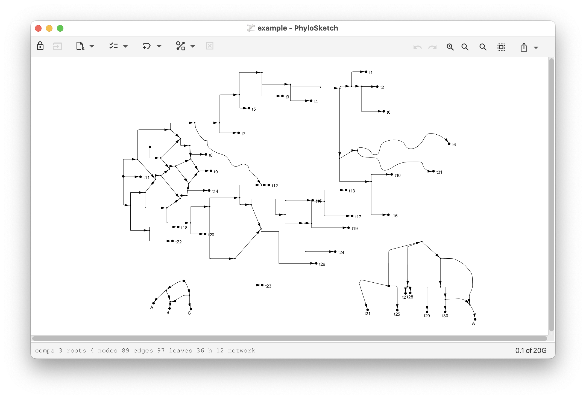

# PhyloSketch App

Daniel H. Huson, University of Tübingen, 2024

## Introduction

PhyloSketch App is an application for interactively creating and editing phylogenetic trees and networks by
drawing them.
The program runs on MacOS X, Linux and Windows, and is also designed for touch-screen devices running iOS or Android.

## Installation

* The MacOS X, Linux and Windows are available from the GitHub page: https://github.com/husonlab/phylosketch2
* The iOS App is available for testing via Apple TestFlight. If you are interested in
  beta testing, then please contact the author for an invitation.
  ~~* Download and install the PhyloSketch app from the App Store or Google Play.~~
* Open the app and grant any necessary permissions for accessing storage, if prompted.

## User Manual

More details are presented in the [User Manual](doc/phylosketch-user-manual.md).