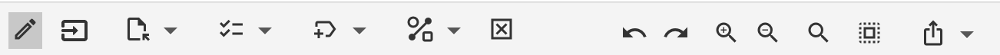
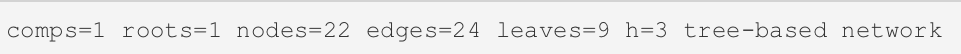

# PhyloSketch App User Manual

Daniel H. Huson, University of Tübingen, 2024

## Introduction

PhyloSketch App is an application for interactively creating and editing phylogenetic trees and networks by
drawing them.
The program runs on MacOS X, Linux and Windows, and is also designed for touch-screen devices running iOS or Android.

## Installation

* The MacOS X, Linux and Windows are available from the GitHub page: https://github.com/husonlab/phylosketch2
* The iOS App is available for testing via Apple TestFlight. If you are interested in
  beta testing, then please contact the author for an invitation.
  ~~* Download and install the PhyloSketch app from the App Store or Google Play.~~
* Open the app and grant any necessary permissions for accessing storage, if prompted.

## Getting Started

When you first open PhyloSketch, you’ll be presented with a canvas containing a simple example tree.
Modify the example or start creating your own phylogenetic tree or network.
The toolbar at the top provides access to all major functions, including mode selection,
import options, and various editing tools.

## Modes Overview

PhyloSketch operates in three primary modes:

###  Edit Mode

* In Edit Mode, you can create new nodes and edges by drawing directly on the canvas.
* Use this mode for building a new tree or network from scratch, or for modifying one.

###  Transform Mode

* Transform Mode allows you to move nodes, reshape edges, and adjust the layout of your phylogenetic tree or network.
* Touch and drag nodes or edges to reposition them.
* Use this mode for fine-tuning the structure after nodes and edges have been created.

###  Read-Only Mode

* In Read-Only Mode, editing is locked, but you can still select nodes or edges for viewing details.
* This mode is useful when you want to view a tree or network without the risk of accidentally modifying it.

## Tool Bar Overview

The toolbar provides access to the core functionalities of PhyloSketch:

### Mode Selection

• Select the desired mode (Edit, Transform, or Read-Only) using the first item on the tool bar.

### Import Button (mobile version only)

* Use the Import button to paste a tree or network (given Newick format) onto the canvas.
* Imported structures will be displayed on the canvas, ready for further editing or analysis.

### Selection Menu Button

The Selection Menu many items for selecting nodes and/or edges based on their properties.
They are:

* All - select all nodes and edges
* None - deselect all nodes and edges
* Invert - invert the selection
* Extend - extend the selection, by first selecting everything below, then everything above, then everthing
  in the same selected component, and then everything.
* Tree Edges - select all tree edges
* Reticulate Edges - select all reticulate edges
* Roots - select all root nodes (indegree 0)
* Leaves - select all leaves (outdegree 0)
* Tree Nodes - select all tree nodes (indegree 0 or 1)
* Reticulate Nodes - select all reticulate nodes (indegree 2 or more)
* Thru Nodes - select all nodes with indegree 1 and outdegree 1
* Visible Nodes - select all visible nodes, i.e. nodes that have path of tree edges down to a leaf
* Visible Reticulations - select all visible reticulate nodes
* Completely Stable Nodes - select all nodes that are on all paths from the root to leaves below them
* All Below - select all nodes below the currently selected nodes
* All Above - select all nodes above the currently selected nodes
* Possible Root Locations - select all nodes or edges where the root may be placed
* Lowest Stable Ancestor - select the lowest stable ancestor of each selected node
* From Previous Window - select nodes that have the same labels as previously selected nodes

### Label Menu Button

The Label Menu provides items for label labeling the nodes and edges of the tree or network.
They apply to the current selection, or to everything, if nothing is selected.

Items for labeling nodes:

* Label Leaves A,B,C... - label leaves A, B, C etc.
* Label Leaves t1,t2,t3... - label leaves t1, t2, t3 etc.
*
* Label All Leaves... - this starts an interactive dialog for typing leaf labels.
*
* Label Internal Nodes A,B,C... - label internal nodes A, B, C etc.
* Label Internal Nodes t1,t2,t3... - label internal nodes t1, t2, t3 etc.
*
* Clear Node Labels - remove all node labels.

Items for labeling edges:

* Show Edge Weights - display edge weights.
* Show Edge Confidences - display edge confidence values.
* Show Edge Probabilities - display edge probabilities (usually only reticulate edges).
*
* Edit Edge Labels - this shows or hides a tool bar for setting or editing edge weights, confidences and probabilities.

### Layout Menu Button

The Layout Menu enables you to customize how edges are displayed, and allows you to change the layout.
Items apply to the current selection, or to everything, if nothing is selected.

Items for changing how edges appear:

* Arrows - draw edges as arrows.
* Outlines - draw tree or network as "outline".
* Smooth - smooth the edges.
* Straight - straighten edges.
* Rectangular - change edge shape to rectangular.

Items for changing the layout:

* Rotate Left - rotate 90o to the left.
* Rotate Right - rotate 90o to the right.
* Flip Horizontal - flip horizontally.
* Flip Vertical - flip vertically.

* Resize Mode - turn resize mode on or off - in resize mode, you can resize and reposition a set of selected nodes.

Other items for modifying the tree or network:

* Remove Thru Nodes - replace any "thru node" (a node that has indegree 1 and outdegree 1) by an edge.

* Change Root - all the root of the tree or network to be changed by selecting a new node or edge.

### Other Toolbar Buttons

* Delete - remove currently selected nodes and/or edges.
* Undo and redo - Revert or repeat your last actions.
* Zoom In and zoom out - Adjust the view of the canvas for closer inspection or an overview.
* Find - Open or close the find toolbar for locating specific nodes and find/replace toolbar for changing node labels.
* Extend Selection - Expand your current selection to include more nodes or edges.
* Export Menu - Copy the current selection or capture an image of the canvas for sharing.

## Status Bar

The status bar at the bottom of the window reports the number of connected components `comps`, the number
of root nodes `roots`, `nodes`, `edges` and `leaves`. It reports the hybridization number `h` and properties that the
tree or network might have, such as `network`, `tree-based network`, or `temporal network`.

## Working with Nodes and Edges

### Creating Nodes and Edges

* In Edit Mode, drag along the canvas to create an edge.
* To create a new node, double-click on the canvas (desktop version) or press in the canvas for 1/2 second (mobile
  version)
* To create new edge, press and drag from a node or edge.
* If you press on an existing node, then this will be the source of the new edge.
* If you press on an existing edge, then a node will be inserted into the existing edge
  and the new edge will attach to it.
* Similarly, if the new edge ends near an existing node or edge, then it will attach to that.

### Transforming Nodes and Edges

* In Transform Mode, select and drag nodes to move them.
* Adjust the shape of edges by dragging on them. After reshaping an edge, optionally use the smooth item to improve
  its shape.
* Fine-tune the layout to achieve the desired appearance.

### Editing Properties

* Use the toolbar to set weights, confidence values, or probabilities for selected edges.
* Toggle the display of these properties using options in the Label Menu.

### Exporting and Sharing

* Use the Export Menu to copy the current selection or save a snapshot of the canvas.
* Exported images or data can be shared directly from your device.
* Display a QR code containing the tree or network in Newick format.

## Left-side Tabs (mobile app only)

The mobile app provides tabs on the left-hand-side of the window.

* The Files tab provides a table of all known documents, specifying name, date last opened, size and kind.
* The File tab has a toolbar that provides items to add a new document, duplicate a document, edit the name
  of an existing document, delete a document, import a new document or open a document. There is also a button
  for toggling between light and dark mode.
* You can switch between open documents by clicking on their tabs.

## Menus (non-mobile app only)

The non-mobile version of the PhyloSketch app provides a menu bar with the following menus:

### File menu

* New - open a new document.
* Open - open an existing document.
* Recent - open a recently opened document.
* Import - import a tree or network in Newick format.
* Export - export a tree or network in Newick format.
* Save - save to a document.
* Page Setup - set up the page for printing.
* Print - print.
* Close - close the current window.
* Quit - quit the program.

### Edit menu

* Undo - undo last operation.
* Redo - redo last operation.
* Cut - cut.
* Сору - copy selected node labels or Newick format.
* Copy Image - copy image of canvas.
* Paste - paste in Newick format.
* Delete - delete selected nodes and/or edges.
* Clear - delete everything.
* Remove Thru Nodes - replace thru nodes by edges.
* Change Root - allow selection of a new root.
* Mode - set the mode to Edit, Move or View.
* Find... - find a node by label.
* Find Again - find the next matching node.

### Select menu

See the above description of the [_Selection Menu Button_](#selection-menu-button).

### Layout menu

See the above description of the [_Layout Menu Button_](#label-menu-button).

### View menu

* Use Dark Theme - turn dark mode on or off.
* Increase Font Size - increase the font size ( urrently not implemented).
* Decrease Font Size decrease the font size ( urrently not implemented).
* Zoom In - zoom in.
* Zoom Out - zoom out.
* Enter Full Screen - enter or exit full screen mode.

### Window menu

* About - show program about screen.
* Check for updates - check whether a new release is available.
* List of all currently open windows.

## Tips and Best Practices

* Start in Edit Mode to build the basic structure of your network.
* Use Transform Mode for refining positions and adjusting edges.
* Label nodes early for easier reference during analysis.
* Regularly export versions of your work to keep backups of your progress.

## Support and Feedback

If you encounter any issues or have suggestions for PhyloSketch, please reach out via the GitHub repository or contact
us through the app’s support page.

### Known issues

This is work in progress and there are a number of known issues:

* The program allows you to create multiple trees and/or networks on the same canvas. At present,
  the status bar reports as if all nodes and edges are part of the same graph.
* iOS 18 allows apps be open in a non-full screen fashion. The PhyloSketch app is not aware of this and
  opening in non-full screen and then resizing might not work correctly. Workaround - to force the app to resize,
  briefly rotate the device to change its orientation and then rotate back.
* PhyloSketch currently does not attend to optimize the layout of an imported rooted phylogenetic network. We are
  working
  on a new algorithm to address this.
* Copy and paste between different PhyloSketch documents is currently based only on the Newick format and thus
  does not preserve formating.
* Paste only pastes in a single tree or network, even if the text or document contains more than one.
* The mobile app is currently only available via Apple Testflight.